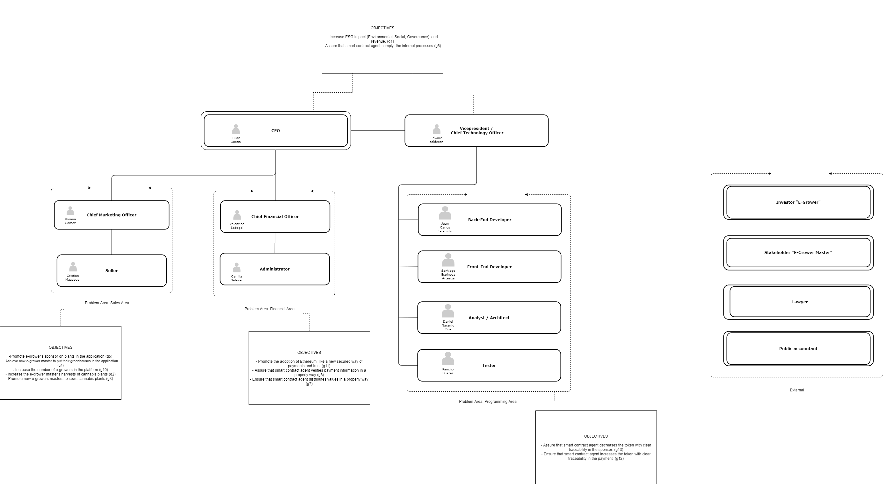

# Organigrama y diferentes tareas de administración

## Tareas y responsables

---

## Ceo

### Requisitos educativos

Debe de tener un título en administración y experiencia de trabajo de mínimo 2 años en roles administrativos de empresas tecnológicas.

### Rol y responsabilidades

Tomar decisiones importantes para el manejo de la empresa, ser un líder importante para todos los miembros del equipo. Crear informes sobre los objetivos, la gestión y los logros.

### Responsable

Julián García

---

## Vicepresidente y CTO

### Requisitos educativos

Debe tener estudios relacionados con la gestión y el desarrollo de software, también debe tener experiencia en el proceso de desarrollo de software en empresas durante un año como mínimo. Debe ser una persona amable que entienda los problemas comunes de los principales departamentos de la empresa.

### Rol y responsabilidades

Apoyar las decisiones del CEO, tener un papel importante en el departamento de gestión, a su vez apoyar a los desarrolladores siendo la persona que conoce a la perfección los objetivos de desarrollo, diseñando así sus directirces de desarrolo.

### Responsable

Edward Calderón

---

## Desarrollador Back-End

### Requisitos educativos

Idealmente debe tener estudios en carreras como ingeniería de software, estadpistica, informática u otra similar. Debe de tener como mínimo un año de expereincia trabajando con tecnologías backend, preferentemente node js, python con django y php con laravel. El postulante debe ser una persona integral que pueda entender sistemas complejos, modelar bases de datos y finalmente tener un uso medio de tecnologías Front-End.

### Rol y responsabilidades

Esta persona es responsable del desarrollo de Backend de los procesos internos de la empresa. Además de esto, debe cumplir con los plazos de entrega y tener experiencia en la gestión de bases de datos con conocimiento de cualquier sistema gestor de base de datos que permita buenas prácticas en el desarrollo.

### Responsable

Juan Carlos Jaramillo

---

## Desarrollador Front-End

### Requisitos educativos

Esta persona debe tener un título relacionado con informática, ingeniería de sistemas, diseño u afines, debe tener un mínimo de 1 año de experiencia gestionando aplicaciones web creadas con el stack básico de html-css-javascript, usar frameworks como angular, react, vue o similares, por último debe tener experiencia con procesos ágiles de desarrollo de software.

### Rol y responsabilidades

Esta persona se encarga del desarrollo Front-End en los desarrollos internos de la empresa, además debe cumplir con los plazos de entrega y crear los diseños de los proyectos que tendrán que ser aprobados por el CTO antes de empezar el proceso del desarrollo

### Responsable

Santiago Espinosa

---

## Analista / Arquitecto de software

### Requisitos educativos

Idealmente debe tener estudios en carreras como ingeniería de software, estadística, informática o afines. Debe tener mínimo de un año de expreriencia trabajando en el desarrollo de software, la planificación de la arquitectura de software y el diseño del sistema desde cero hasta producción.

### Rol y responsabilidades

Esta persona se encarga del análisis y definición de las arquitecturas de desarrollo que deben ser presentadas al CTO , éste debe aprobar la propuesta de arquitectura y también debe definir los tiempos de desarrollo y la recogida de requisitos. Después de esto, el CTO y el arquitecto deben de comunicar el proyecto a los desarrolladores y ser soporte para cualquier duda del equipo

### Responsable

Daniel Naranjo Ríos

---

## Tester

### Requisitos educativos

Esta persona debe tener un título relacionado con la informática, las matemáticas o la ingeniería o afines, además debe tener un mínimo de dos años de experiencia trabajando en el desarrollo, ejecución de pruebas funcionales de QA, planes y casos de prueba y gestión de documentación de pruebas.

### Rol y responsabilidades

Esta persona se encarga de la prueba de todos los módulos desarrollados en el área de programación, por cada prueba que realiza debe generar un documento donde pondrá los aspectos a mejorar y errores percibidos, el cual debe ser enviado al desarrollador responsable y en base al documento se hará la siguiente revisión.

### Responsable

Pancho Suárez

---

## Administrador

### Requisitos educativos

Esta persona debe tener un titulo superior relacionado con la administración de empresas o la gestión empresarial. Debe de tener un mínimo de dos años de experiencia en responsabilidades como archivar papeles, reunirse con los interesados internos y externos, presentar información importante, desarrollar procesos y responder a las preguntas de los empleados.

### Rol y responsabilidades

Un administrador proporciona apoyo de oficina a un individuo o a un equipo y es vital para el buen funcionamiento de una empresa. Sus funciones pueden incluir la recepción y dirección de visitantes, el procesamiento de textos, la creación de hojas de cálculo, presentaciones y el archivo.

### Responsable

Camila Salazar

---

## Director financiero

### Requisitos educativos

Esta persona debe tener una titulación relacionada con la administración de empresas, las finanzas, la economía o afines, debe tener un mínimo de dos años trabajando en el sector financiero y gestionando un equipo.

### Rol y responsabilidades

Esta persona es responsable de gestionar el flujo de caja de la empresa, también de hacer planes financieros y analizar las fortalezas y debilidades de Egroweed.

### Responsable

Valentina Sabogal

---

## Director de marketing

### Requisitos educativos

Esta persona debe tener un título superior que tendrá que ser complementado con una especialización en marketing y debera contar con varios años de experiencia en marketing y también liderando un equipo en este área

### Rol y responsabilidades

Un director de marketing supervisa el departamento de ventas, Planifica, direcciona y coordina los esfuerzos de marketing utilizados para la promoción de egroweed.

### Responsable

Jhoana Gómez

---

## Vendedor

### Requisitos educativos

Esta persona no necesita un título, pero necesita un mínimo de tres años de experiencia en la gestión de las cuestiones operativas de los vendedores del mercado y gestionar los correos electrónicos y las llamadas entrantes y salientes.

### Rol y responsabilidades

Vender, promocionar y anunciar los servicios de Egroweed. Buscar nuevos clientes y personas en el mercado e invitarlos a unirse a la empresa.

### Responsable

Christian Mazabuel
